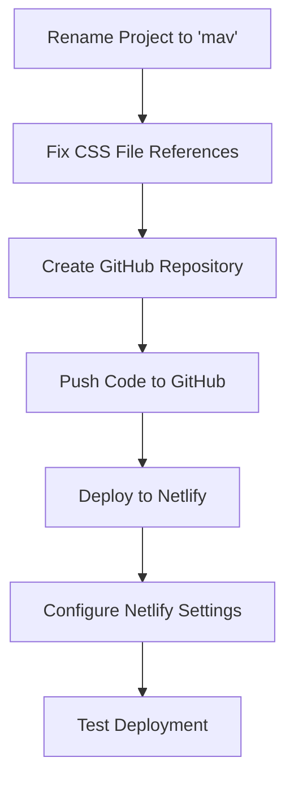

# Mav Website Deployment Plan

## Problem Analysis

The main issue preventing the CSS from working on Netlify is that when the site was downloaded with wget, the CSS files were saved with query parameters as part of their filenames (e.g., `style.min.css?ver=3.3.0.css` instead of just `style.min.css`). However, the HTML is still referencing these files without the query parameters, causing the CSS not to load properly.

## Plan Overview



## Detailed Steps

### 1. Rename Project Folder
- Create a new directory named "mav"
- Copy all files from the current directory to the new "mav" directory
- This will be our working directory for all subsequent steps

### 2. Fix CSS Issues
We'll rename CSS files by removing query parameters and update HTML references:
- Identify all CSS files with query parameters in filenames
- Create a script to rename these files (removing query parameters)
- Update all HTML files to reference the renamed CSS files
- Test locally to ensure CSS loads properly

#### Technical Implementation Details
- Use a script to find all CSS files with patterns like `*.css?ver=*.css`
- Rename them to remove the query parameters (e.g., `style.min.css?ver=3.3.0.css` → `style.min.css`)
- Use a search and replace operation across all HTML files to update references
- Pay special attention to files in:
  - wp-content/themes/hello-elementor/
  - wp-content/plugins/elementor/assets/css/
  - wp-content/plugins/elementor/assets/css/conditionals/
- Test the site locally by opening index.html in a browser to verify CSS loads correctly

### 3. Create and Configure GitHub Repository
- Create a new GitHub repository named "mav"
- Initialize the local repository
- Add all files to the repository
- Commit changes
- Connect to the remote GitHub repository
- Push the code to GitHub

#### Technical Implementation Details
```bash
# Initialize git repository
git init

# Add all files
git add .

# Commit changes
git commit -m "Initial commit"

# Add remote repository
git remote add origin https://github.com/[username]/mav.git

# Push to GitHub
git push -u origin main
```

### 4. Deploy to Netlify
- Log in to Netlify
- Connect to the GitHub repository
- Configure build settings (if needed)
- Deploy the site
- Configure custom domain (if needed)

#### Technical Implementation Details
- In Netlify dashboard, click "New site from Git"
- Select GitHub and authorize if needed
- Select the "mav" repository
- Configure build settings:
  - Build command: leave blank (static site)
  - Publish directory: leave as root directory
- Click "Deploy site"
- Monitor the deployment process
- Once deployed, test the site to ensure CSS is loading properly

### 5. Testing and Verification
- Verify that the site is deployed correctly
- Check that CSS is loading properly
- Test navigation and functionality
- Make any necessary adjustments

## Potential Challenges and Solutions

1. **Large Number of Files**: The site has many files, which might make manual renaming tedious. We'll use scripts to automate this process.

2. **Nested References**: Some CSS files might reference other files with query parameters. We'll need to ensure all references are updated.

3. **Netlify Build Settings**: Depending on the site structure, we might need to configure specific build settings in Netlify. We'll determine this during the deployment process.

4. **Redirects and Rewrites**: We might need to set up redirects or rewrites in Netlify to handle certain URL patterns. We'll address this if needed during testing.

## Next Steps

After implementing this plan, we should have a fully functional website deployed on Netlify with proper CSS styling. If any issues arise during implementation, we'll address them as needed.